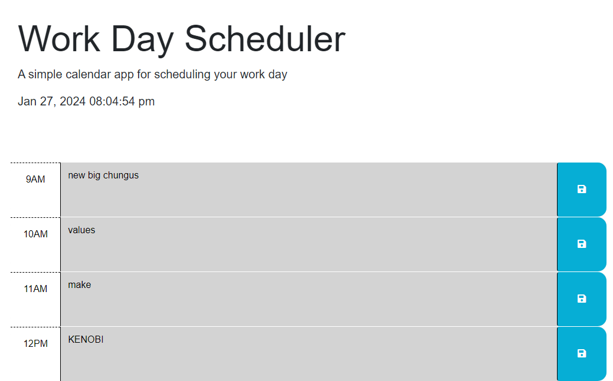

# Work Day Scheduler

## Description

Welcome to my Work Day Scheduler! I created this program to help organize my daily tasks on business days. 
It will be useful on very busy days that need to be scheduled hour by hour and can also easily accomodate updating one's schedule as necessary.
I learned a lot about JQuery methods and comparing values. In particular, I learned comparing values of id to dayjs hours required ids to be written in '##' double digit format
(08, 09, etc)

## Usage

This program is incredibly simple to use. In the header the current date and time are displayed for reference when deciding where and what to enter.
In the space between time and the 'save' button you can click and add text for items that have specific time slots. once you're done adding text click the 'save' icon to the right of the text you just entered. The text will be saved until it is overwritten by new saved information.

## License

MIT License

## How to Contribute

Contributions are not being accepted at this time.

## Tests

tested saving different values to div ids to make sure past present and future functionality operated correctly. additionally program correctly allowed user to write and save text as well as save over old text to save new values.